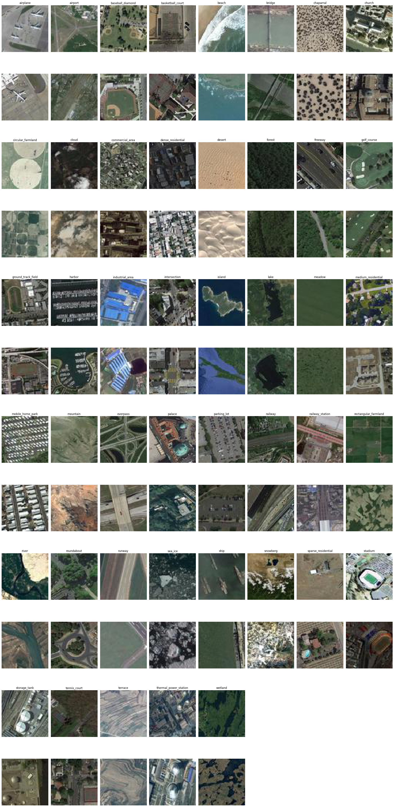

# ResNet50
Aerial image classification into 45 different classes using deep learning (ResNet50) with NWPU dataset

The repository contains the final report that was returned for Aalto University Machine learning course

Two different ML models logistic regression (multi-class) and a convolutional neural network (ResNet50) were benchmarked against eachother. 
ResNet50 has superior performance, which is motivated and visualized in the final report

